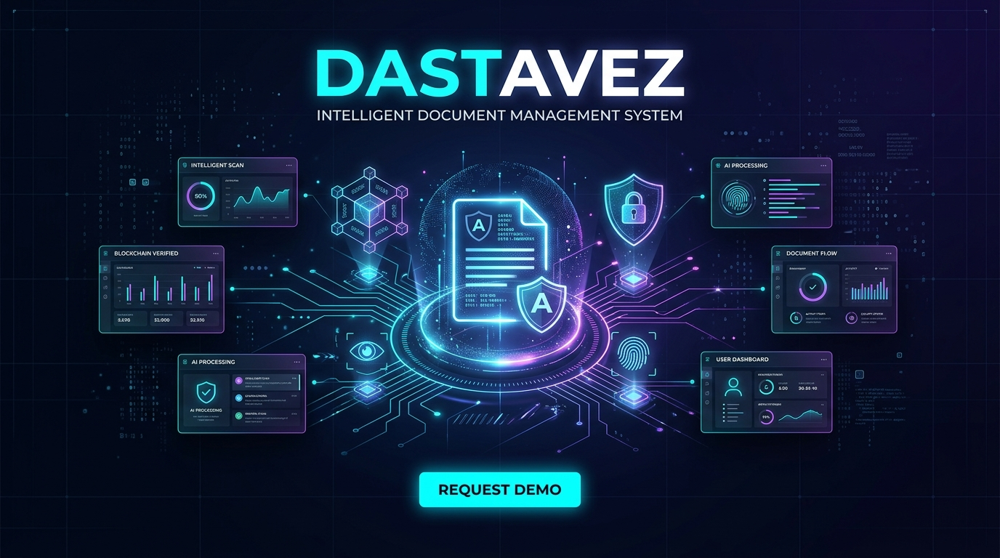
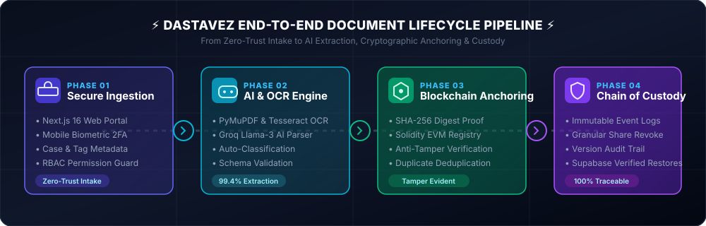
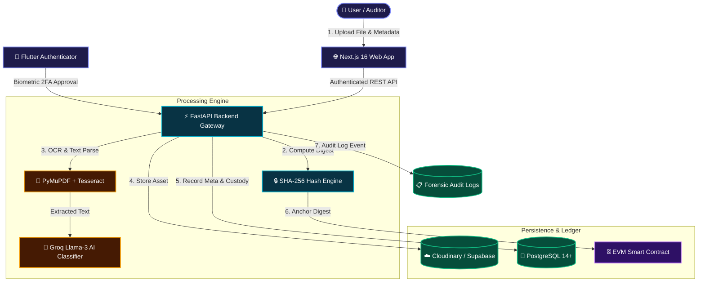
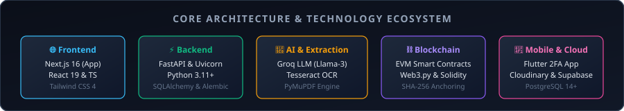

<div align="center">

# 📑 DASTAVEZ (दस्तावेज़) 🛡️
### *Next-Gen Secure, Intelligent & Blockchain-Anchored Document Management System*

<p align="center">
  
</p>

[](https://nextjs.org/)
[](https://fastapi.tiangolo.com/)
[](https://www.python.org/)
[](https://www.postgresql.org/)
[](https://flutter.dev/)
[](https://ethereum.org/)
[](https://groq.com/)
[](https://tailwindcss.com/)

---

### 🌟 *"Where Cryptographic Integrity Meets AI-Powered Document Intelligence"*

[Explore Features](#-key-features) • [Architecture](#-system-architecture) • [Quick Start](#-quick-start-guide) • [API Specs](#-api-endpoints) • [Mobile Authenticator](#-mobile-authenticator-2fa) • [Contributing](#-contributing)

</div>

---

## 📖 Table of Contents
- [✨ Overview](#-overview)
- [💥 The Problem vs. The Dastavez Solution](#-the-problem-vs-the-dastavez-solution)
- [🚀 Key Features](#-key-features)
- [🔄 Document Processing Pipeline](#-document-processing-pipeline)
- [🏗️ System Architecture](#-system-architecture)
- [💻 Tech Stack](#-tech-stack)
- [📂 Project Structure](#-project-structure)
- [⚡ Quick Start Guide](#-quick-start-guide)
  - [1. Backend Setup](#1-backend-setup-fastapi)
  - [2. Frontend Setup](#2-frontend-setup-nextjs)
  - [3. Mobile Setup](#3-mobile-setup-flutter)
- [🔌 API Endpoints](#-api-endpoints)
- [🛡️ Security, RBAC & Custody](#-security-rbac--chain-of-custody)
- [🧪 Testing & Quality Assurance](#-testing--quality-assurance)
- [🤝 Contributing](#-contributing)
- [👨‍💻 Author & Maintainer](#-author--maintainer)
- [📜 License](#-license)

---

## ✨ Overview

**Dastavez** (*दस्तावेज़ — Urdu/Hindi for official records and critical documents*) is an enterprise-grade, zero-trust **Document Management System (DMS)** tailored for high-security environments.

Far beyond conventional cloud drives, Dastavez delivers an end-to-end verifiable lifecycle for critical paperwork—from drag-and-drop ingestion to **optical character recognition (OCR)**, **Groq-accelerated LLM semantic classification**, **SHA-256 deduplication**, **EVM smart-contract hash anchoring**, **device-bound biometric 2FA**, and **forensic chain-of-custody tracking**.

<div align="center">
  
</div>

---

## 💥 The Problem vs. The Dastavez Solution

Traditional document handling suffers from fragmentation, security vulnerabilities, and zero evidentiary guarantees. Here is how Dastavez changes the game:

| ❌ The Old Way (Shared Folders & Cloud Drives) | ✅ The Dastavez Way |
| :--- | :--- |
| 📁 **Disorganized Buckets**: Files dumped into chaotic folders with zero context. | 🧠 **Context-Rich Intake**: Automated tagging, case association, and required-field schemas. |
| 🔍 **Blind Files**: Non-searchable scanned PDFs and image receipts. | ⚡ **Deep OCR & AI Parsing**: Multi-engine OCR (Tesseract + PyMuPDF) with Groq LLM extraction. |
| ❓ **Silent Tampering**: Anyone with access can edit files undetected. | ⛓️ **Tamper-Evident Blockchain**: Every revision's SHA-256 hash anchored to an immutable smart contract. |
| 🪪 **Vulnerable Logins**: Phishable passwords easily compromised. | 📱 **Device-Bound Biometrics**: Flutter authenticator with cryptographic challenge-response keys. |
| 🕵️ **Missing Accountability**: Impossible to tell who downloaded or altered files. | 📜 **Forensic Chain of Custody**: Cryptographically signed audit trail recording every access & action. |
| 👥 **Uncontrolled Sharing**: Links forwarded freely with no expiration. | 🔒 **Revocable Share Links**: Granular permissions, expiry dates, and instant revocation. |
| 💾 **Untested Backups**: Backups stored blindly without integrity validation. | 🛡️ **Verifiable Disaster Recovery**: Automated snapshots with non-destructive restore testing. |

---

## 🚀 Key Features

### 🧠 1. Intelligent AI Extraction & OCR
* **Multi-Engine Ingestion**: Seamlessly processes native PDFs, scanned legal agreements, and image files via `PyMuPDF`, `Pillow`, and `Tesseract OCR`.
* **Groq Llama-3 Classification**: High-speed LLM automatically extracts key entities, suggests categories, and classifies sensitive documents in milliseconds.
* **Metadata Schema Validation**: Enforces mandatory field compliance and flags data inconsistencies before files reach production storage.

### ⛓️ 2. Blockchain-Anchored Integrity Proofs
* **SHA-256 Fingerprinting**: Generates unique cryptographic digests for every file version upon ingestion.
* **Solidity Smart Contract Registry**: Anchors hashes to an EVM-compatible blockchain via `Web3.py`.
* **One-Click Tamper Verification**: Instantly matches the live document digest against the on-chain immutable ledger to mathematically prove zero tampering.

### 📱 3. Mobile Authenticator & Biometric 2FA
* **Out-of-Band Authorization**: Built-in Flutter cross-platform companion app for Android and iOS.
* **Hardware-Backed Keys**: Generates cryptographic keypairs on the physical mobile device.
* **Biometric Approval**: Login challenges on the web trigger instant biometric (FaceID / Fingerprint) mobile prompts. Session JWTs are never exposed to the mobile app.

### 📜 4. Forensic Chain of Custody & Audit Trail
* **Full Event Telemetry**: Every upload, preview, download, metadata modification, and share grant is recorded.
* **Actor Attribution**: Timestamps, IP addresses, user identities, and hash signatures recorded for every action.
* **Strict RBAC Enforcement**: Backend-authoritative permissions ensure users only view what their role permits.

### 🔄 5. Version Control & Smart Deduplication
* **Zero Duplication Waste**: Identical content uploads are instantly flagged and mapped, saving storage costs.
* **Linear Version Trees**: Clear lineage of revisions with author notes, diff tracking, and previous-version rollback.

### 💾 6. Resilient Backups & Restore Verification
* **Cloud Storage Flexibility**: Production integration with Cloudinary and Supabase Storage.
* **Non-Destructive Testing**: Test restore workflows safely in an isolated sandbox to certify disaster recovery readiness.

---

## 🔄 Document Processing Pipeline



---

## 🏗️ System Architecture

<div align="center">
  
</div>

Dastavez separates operational tiers cleanly to ensure server-side security cannot be bypassed:

```
┌────────────────────────────────────────────────────────┐
│                   CLIENT SURFACES                      │
│   Next.js 16 (React 19, TypeScript, Tailwind 4)        │
│   Flutter Cross-Platform Mobile Authenticator          │
└───────────────────────────┬────────────────────────────┘
                            │ HTTPS / WSS / REST
┌───────────────────────────▼────────────────────────────┐
│               AUTHORITATIVE BACKEND LAYER               │
│   FastAPI Gateway • Pydantic Contracts • PyJWT / Argon2 │
│   RBAC Guard • Deduplication Engine • Version Router   │
└───────┬──────────────┬──────────────┬───────────┬──────┘
        │              │              │           │
┌───────▼──────┐┌──────▼──────┐┌──────▼────┐┌─────▼──────┐
│  DATA STORE  ││   STORAGE   ││ AI ENGINE ││ BLOCKCHAIN │
│  PostgreSQL  ││ Cloudinary  ││ Groq LLM  ││ Solidity   │
│  SQLAlchemy  ││  Supabase   ││ Tesseract ││ EVM / Web3 │
│   Alembic    ││   Storage   ││  PyMuPDF  ││  py-solc-x │
└──────────────┘└─────────────┘└───────────┘└────────────┘
```

---

## 💻 Tech Stack

| Domain | Technology | Purpose |
| :--- | :--- | :--- |
| **Frontend** | [Next.js 16](https://nextjs.org/) + [React 19](https://react.dev/) | High-performance App Router interface |
| **Language & Types** | [TypeScript](https://www.typescriptlang.org/) | Type-safe enterprise code |
| **Styling** | [Tailwind CSS 4](https://tailwindcss.com/) + [Lucide Icons](https://lucide.dev/) | Modern cyber-dark glassmorphism styling |
| **Backend API** | [FastAPI](https://fastapi.tiangolo.com/) + [Uvicorn](https://www.uvicorn.org/) | Ultra-fast asynchronous RESTful microservices |
| **Database** | [PostgreSQL 14+](https://www.postgresql.org/) + [SQLAlchemy](https://www.sqlalchemy.org/) | Relational database & ORM modeling |
| **Migrations** | [Alembic](https://alembic.sqlalchemy.org/) | Controlled database schema revisions |
| **Authentication** | [PyJWT](https://pyjwt.readthedocs.io/) + [pwdlib / Argon2](https://github.com/hynek/argon2-cffi) | Cryptographic password hashing & token issuance |
| **Mobile 2FA** | [Flutter](https://flutter.dev/) + Dart | Out-of-band biometric challenge verification |
| **AI Classifier** | [Groq](https://groq.com/) (Llama-3 API) | Near-instant document semantic classification |
| **OCR & Extraction**| [Tesseract OCR](https://github.com/tesseract-ocr/tesseract) + [PyMuPDF](https://pymupdf.readthedocs.io/) | Scanned document text & raster parsing |
| **Blockchain** | [Solidity](https://soliditylang.org/) + [Web3.py](https://web3py.readthedocs.io/) | EVM smart contract registry for hash anchoring |
| **Cloud Storage** | [Cloudinary](https://cloudinary.com/) + [Supabase](https://supabase.com/) | Secure cloud object storage and backup buckets |

---

## 📂 Project Structure

```bash
Dastavez/
├── 🌐 frontend/                    # Next.js 16 Web Application
│   ├── app/                       # App Router pages (auth, dashboard, documents, audit)
│   ├── components/                # Glassmorphic UI components & badges
│   ├── lib/                       # API clients, auth helpers, types
│   └── public/                    # Web assets & vectors
│
├── ⚡ backend/                     # FastAPI Application & Microservices
│   ├── app/
│   │   ├── models/                # SQLAlchemy database schema models
│   │   ├── routers/               # Modular endpoints (auth, docs, custody, backup, audit)
│   │   ├── schemas/               # Pydantic v2 validation contracts
│   │   ├── services/              # AI (Groq), OCR, Storage, Hash & Blockchain services
│   │   ├── database.py            # Async engine session factories
│   │   └── main.py                # FastAPI bootstrap application
│   ├── blockchain/                # Solidity registry smart contracts (.sol) & ABI
│   ├── alembic/                   # Database version migration scripts
│   ├── requirements.txt           # Python dependency specifications
│   └── .env.example               # Backend configuration blueprint
│
├── 📱 mobile/                      # Flutter 2FA Authenticator App
│   ├── lib/                       # Biometrics, QR scanner, crypto-key storage
│   ├── android/                   # Native Android manifest & biometric policies
│   ├── ios/                       # Native iOS FaceID capabilities
│   └── pubspec.yaml               # Flutter package definitions
│
├── 📁 assets/                     # README diagrams, banners & illustrations
└── 📖 documentation/              # Architecture guides, schema specs & user docs
```

---

## ⚡ Quick Start Guide

### 📋 Prerequisites
* 🐍 **Python 3.11+**
* 🟩 **Node.js 20+** & `npm`
* 🐘 **PostgreSQL 14+** (running locally or cloud instance)
* 🐦 **Flutter SDK** (Dart 3.11+) *(for mobile authenticator)*
* 🔑 *(Optional for live services)*: Groq API Key, Cloudinary Credentials, Supabase Token, EVM RPC URL

---

### 1. ⚡ Backend Setup (FastAPI)

```powershell
# 1. Navigate to backend directory
cd backend

# 2. Create and activate a Python virtual environment
python -m venv .venv
.\.venv\Scripts\Activate.ps1    # On Linux/macOS: source .venv/bin/activate

# 3. Install dependencies
pip install -r requirements.txt

# 4. Configure environment variables
Copy-Item .env.example .env     # On Linux/macOS: cp .env.example .env
# Edit .env with your PostgreSQL credentials, JWT secret, and keys

# 5. Apply database migrations
alembic upgrade head

# 6. Start the development server
uvicorn app.main:app --reload --host 127.0.0.1 --port 8000
```

🔗 **Backend URLs:**
* 🎯 API Gateway: `http://127.0.0.1:8000`
* 📑 Interactive OpenAPI Swagger Docs: `http://127.0.0.1:8000/docs`
* 🩺 Health Check: `http://127.0.0.1:8000/health`
* 🗄️ Database Health: `http://127.0.0.1:8000/health/db`

---

### 2. 🌐 Frontend Setup (Next.js 16)

Open a new terminal window:

```powershell
# 1. Navigate to frontend directory
cd frontend

# 2. Install Node dependencies
npm install

# 3. Configure API target (or create .env.local)
$env:NEXT_PUBLIC_API_BASE_URL = "http://localhost:8000"

# 4. Launch Next.js dev server
npm run dev
```

🌐 **Visit Web App:** Open `http://localhost:3000` in your browser.

```powershell
# Useful frontend checks
npm run lint      # Run ESLint validation
npm run build     # Verify production bundle build
```

---

### 3. 📱 Mobile Setup (Flutter Authenticator)

Open a third terminal window:

```powershell
# 1. Navigate to mobile directory
cd mobile

# 2. Fetch packages
flutter pub get

# 3. Check for analysis warnings
flutter analyze

# 4. Launch on connected device or emulator
flutter run
```

---

## 🔌 API Endpoints

The API is fully documented with interactive Swagger UI at `/docs`. Below is a quick overview of primary route categories:

| Module | Method | Endpoint | Description |
| :--- | :---: | :--- | :--- |
| **Authentication** | `POST` | `/api/auth/login` | Email/password login & challenge generation |
| | `POST` | `/api/auth/verify-otp` | Multi-factor OTP verification |
| | `GET` | `/api/auth/me` | Fetch active user session & role details |
| **Documents** | `POST` | `/api/documents/upload` | Secure file ingestion with OCR & Groq parsing |
| | `GET` | `/api/documents` | Paginated document listing with filter criteria |
| | `GET` | `/api/documents/search` | Full-text and metadata semantic search |
| | `GET` | `/api/documents/{id}/versions` | List complete historical version revisions |
| **Validation** | `POST` | `/api/documents/{id}/validate-required-fields` | Verify presence of compulsory schema metadata |
| | `POST` | `/api/documents/{id}/validate-consistency` | Cross-check OCR text vs claimed metadata |
| **Custody & Audit** | `GET` | `/api/documents/{id}/custody` | Detailed cryptographic chain-of-custody log |
| | `GET` | `/api/audit-logs` | Organization-wide forensic event registry |
| **Blockchain** | `POST` | `/api/documents/{id}/blockchain-verify` | Validate current hash against on-chain anchor |
| **Sharing** | `POST` | `/api/documents/{id}/shares` | Create time-bound secure share links |
| | `DELETE`| `/api/shares/{share_id}` | Instantly revoke access to a shared link |
| **Disaster Recovery**| `POST` | `/api/backups/create` | Trigger automated encrypted storage backup |
| | `POST` | `/api/backups/restore-test` | Run sandbox non-destructive restore check |

---

## 🛡️ Security, RBAC & Chain of Custody

```
                                  +-------------------+
                                  | Zero-Trust Intake |
                                  +---------+---------+
                                            |
                         +------------------v------------------+
                         |  FastAPI Authoritative RBAC Guard   |
                         |  - Role & Permission Checks         |
                         |  - Input Validation via Pydantic    |
                         +------------------+------------------+
                                            |
                 +--------------------------+--------------------------+
                 |                                                     |
        +--------v--------+                                   +--------v--------+
        |  PostgreSQL DB  |                                   | Blockchain Log  |
        |  Custody Events |                                   | SHA-256 Anchor  |
        +-----------------+                                   +-----------------+
```

> [!IMPORTANT]
> **Zero-Trust Rule**: The frontend and mobile apps are convenience clients. All authorization, permission evaluation, signature checks, and sanitization are strictly executed and enforced on the FastAPI backend.

* 🔐 **Never commit secrets**: Keep `.env` files, JWT secrets, private keys, and cloud storage credentials in your local environment.
* 🛡️ **Cryptographic Digests**: Documents are verified using SHA-256 digests. Changing even a single bit in a file changes its hash and flags an immediate tampering alert.
* 📜 **Proof of Existence**: Blockchain verification confirms that an exact document state was anchored at a specific block number and time.

---

## 🧪 Testing & Quality Assurance

Run the automated test suite across all sub-projects before submitting any code:

```powershell
# 1. Backend Pytest
cd backend
pytest -v

# 2. Frontend Validation
cd ../frontend
npm run lint
npm run build

# 3. Mobile Code Quality
cd ../mobile
flutter analyze
```

---

## 🤝 Contributing

Contributions, bug reports, and feature proposals are welcome! 

1. **Fork** the repository
2. **Create** your feature branch: `git checkout -b feature/amazing-feature`
3. **Commit** your changes: `git commit -m "feat: Add smart batch upload support"`
4. **Push** to the branch: `git push origin feature/amazing-feature`
5. **Open** a Pull Request

---

## 👨‍💻 Author & Maintainer

<div align="center">

### **Shubham Panchal**
*Full-Stack Engineer & System Architect*

[](https://github.com/Shubhampanchal108)
[](https://github.com/Shubhampanchal108/Dastavez)

</div>

---

## 📜 License

This project is licensed under the terms of the private/project license. See the repository settings and license documentation for details.

<div align="center">

---

⭐ **Found this project useful? Give it a Star on GitHub!** ⭐

*Built with ❤️ for secure, traceable, and intelligent document ecosystems.*

</div>
